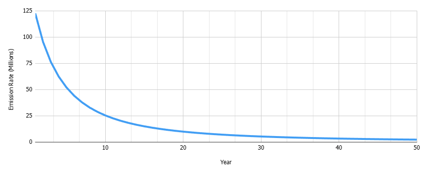

# xbid-ai-escrow

## XBID Escrow Contract

This Stellar escrow contract locks the full [XBID](https://stellar.expert/explorer/public/asset/XBID-GAWUKSYHK4ORD6YTC6366CQQNVNVGBDDJKRRQOG3NUZMMAGSM547XBID) supply and deterministically releases it over time using a frequency-independent, **permissionless**, emission schedule with monotonic decay and a long tail.

## Deployment

Deployed on Stellar Mainnet

| Address           |                                                                                                       |
|---------------------|------------------------------------------------------------------------------------------------------------|
| Escrow Contract ID         | [CCFPI...BB72ZU](https://stellar.expert/explorer/public/contract/CCFPIXHDA3IYFHCBJMR27H6FBLSEFDO2TPB73FJT4SAVCFHSQKBB72ZU) |
| XBID SAC    | [CCWRP...5GJJBO](https://stellar.expert/explorer/public/contract/CCWRPVDCH6BDU4DPJ37IG7UMSX5CQBTOMLMN6I4OMYL27B7QR75GJJBO) |
| XBID Issuer         | [GAWUK...47XBID](https://stellar.expert/explorer/public/account/GAWUKSYHK4ORD6YTC6366CQQNVNVGBDDJKRRQOG3NUZMMAGSM547XBID) |

## Emission Model

The emission follows a **smooth hyperbolic decay curve** controlled by a fixed half-life (7 years). Emissions are highest in early years and decrease predictably over time, asymptotically approaching zero. The curve is continuous in time (no epochs or step functions).

### Specification

Let:

- `P` = emission pool
- `H` = half-life
- `t` = elapsed

Cumulative emitted tokens at time `t`:

```
E(t) = P * (1 - H / (H + t))
```

Emission for a given `release` call:

```
Δ = E(t) - emitted
```



### Canonical parameters

| Parameter      | Value                                 |
|----------------|---------------------------------------|
| total_supply   | 1,000,000,007.00 XBID                 |
| allocation     | 20,000,000.14 XBID (2% of supply)     |
| fund_bps       | 100                                   |
| half_life      | 7 × 6,307,200 ledgers                 |

## Supply Lifecycle

At `initialization`, the entire XBID token balance held by `admin` is transferred to the escrow contract and must equal `total_supply`. The contract then deterministically routes the fixed allocation to the `fund` address, while the remaining supply is **locked under the emission schedule**.

All subsequent emissions originate from the escrow through **permissionless** `release` calls.

## Source & License
`xbid-ai-escrow` is licensed under the MIT License. See [MIT License](LICENSE) for more details.